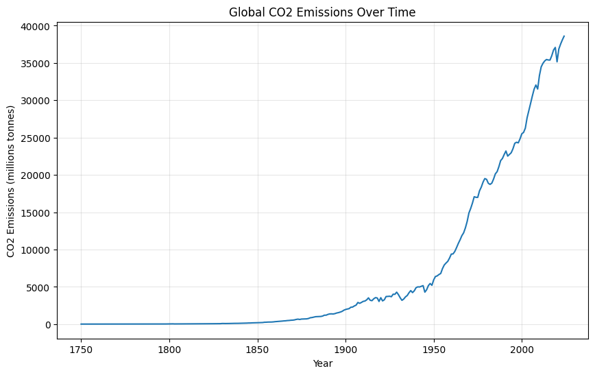

# Analysis of Global Emission Trends and Drivers
Data was extracted from the OWID(Our World in Data) co2 data repsository, which contain information on CO2 emissions on over 164 countries, and other variables such as year, is
o code, population, GDP, co2, co2-per-capita, energy-per-capita, and energy-per-GDP.

# Link to Dataset

https://github.com/owid/co2-data/blob/master/owid-co2-data.csv
https://github.com/owid/co2-data/blob/master/owid-co2-codebook.csv

# Top Emitters: Total vs. Per Capita
Which countries emit the most CO2, and are their differences in when measuring for emission-per-capita?
The top 10 largest emitters of CO2 from greatest to least were China, US, India, Russia, Japan, Indonesia, Iran, Saudia Arabia, South Korea, and Germany.
Interestingly, the list changes when measuring CO2-per-capita: Qatar, Kuwait, Brunei, Bahrain, Trinidad and Tobago, Saudi Arabia, United Arab Emirates, New Caledonia, Sint Maarten, and Oman in order from greatest to least. 
<pre>
latest_year = data[data['year']==2024]
countries= latest_year[latest_year['iso_code'].str.len()==3]
countries[['country', 'co2']].sort_values('co2', ascending=False).head(10)

countries[['country', 'co2_per_capita']].sort_values('co2_per_capita', ascending=False).head(10)
</pre>

# Global Emissions Over Time
A graph was created to examine how global CO2 emissions have chagned thoughout history. The data goes back from 1750 to 2024. Global emissions are near xzero until around 1850, likley due to the INdustrial Revolution. There is a sharp increase in emissions after 1950, to today.

# Correlation Between Wealth and Emissions
Is there relationship between a country's wealth and CO2 emissions per person? There is a strong correlation, with a few outliers. Sweden, France, and Switzerland are countries that have low emissions but are extremely wealthy. There are signs that other energy sources that are clean and renewable are being used more in these nations.

<pre>
corr= subset['gdp_per_capita'].corr(subset['co2_per_capita'])
print(corr)
</pre>

# Decoupling Economic Growth and CO2 emissions
It is possible for a country to see GDP increase whilst still cutting CO2 emissions. The UK's GDP and CO2 rose together through the industrial era, then there is a decoupling around 1970. Since 1970, GDP doubled while the country's CO2 emissions decreased by more than half. Note that this emission is based of territory and not consumption.

  

# Predicting Per-Capita Emissions using Linear Regression
Simple ML techniques were used to determine what features are best in order to predict a country's per-capita emissions. Please note that traditional feature selection techniques were not used, but rather were chosen based off some assumptions. Multiple linear regression using GDP-per-capita, energy-per-capita, and energy per GDP, with a R^2 of 0.43 was found. When standardizing the coefficients, it was shown that energy consumption per capita was the most significant feature. Note that this model explains only 43% of variation, so other features must be looked at for a fuller picture.

<pre>
from sklearn.linear_model import LinearRegression
from sklearn.model_selection import train_test_split
from sklearn.metrics import r2_score, mean_squared_error

#countries from 2022
model_data= data[(data['year']==2022) & (data['iso_code'].str.len() == 3)]

#GDP per capita
model_data['gdp_per_capita'] = model_data['gdp'] / model_data['population']

columns_used=['gdp_per_capita', 'energy_per_capita', 'energy_per_gdp']
model_data=model_data[['country']+ columns_used+['co2_per_capita']].dropna()

X=model_data[['gdp_per_capita', 'energy_per_capita', 'energy_per_gdp']]
Y=model_data['co2_per_capita']
print("Countries in model:", X.shape[0])
X.head()
#Split the data into training and testing sets (80% training, 20% testing)
X_train, X_test, Y_train, Y_test = train_test_split(X, Y, test_size=0.2, random_state=42)

#train the model
model= LinearRegression()
model.fit(X_train, Y_train)

#predict on the test set
Y_pred=model.predict(X_test)

r2= r2_score(Y_test, Y_pred)
RMSE= mean_squared_error(Y_test, Y_pred)**0.5
print("R-squared:", r2)
print("RMSE:", RMSE)
#Standardize the features for better interpretability of coefficients
from sklearn.preprocessing import StandardScaler

scaler= StandardScaler()
Xtrain_scaled= scaler.fit_transform(X_train)
Xtest_scaled= scaler.transform(X_test)

#train the model on standardized data
model_scaled= LinearRegression()
model_scaled.fit(Xtrain_scaled, Y_train)

for i in range(len(columns_used)):
    print(f"Coefficient for {columns_used[i]}: {model_scaled.coef_[i]}")
<pre>

